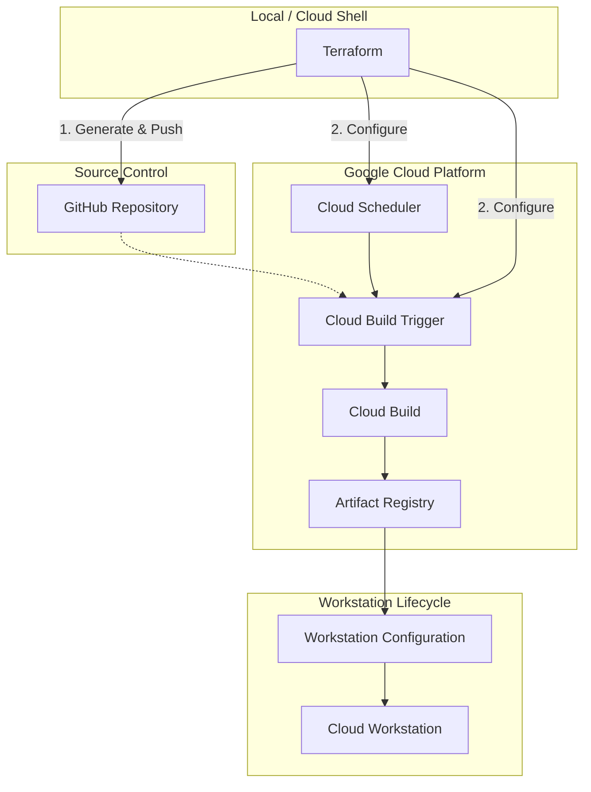

# Cloud Workstations Image Pipeline

The Cloud Workstations (CWS) Image Pipeline is an automated system designed to build, maintain, and secure custom container images for Google Cloud Workstations. It ensures that development environments are consistent, up-to-date, and pre-configured with necessary tools and models.

## Architecture Overview

The pipeline leverages several Google Cloud services to automate the lifecycle of workstation images:



### Components

1.  **Terraform**: Orchestrates the setup. It generates Dockerfiles and Cloud Build configurations from templates and pushes them to a dedicated GitHub repository.
2.  **GitHub Repository**: Acts as the source of truth for image definitions.
3.  **Cloud Build Triggers**: Watch for changes in the GitHub repository to trigger builds.
4.  **Cloud Scheduler**: Triggers Cloud Build daily to ensure images incorporate the latest security patches from base images.
5.  **Cloud Build**: Executes the container build process, tagging and pushing images to Artifact Registry.
6.  **Artifact Registry**: Securely stores the resulting container images.

## Image Templates

The pipeline includes several pre-configured image templates:

### 1. Antigravity CRD (`antigravity-crd`)
- **Purpose**: Provides a headless desktop environment accessible via [Chrome Remote Desktop](https://remotedesktop.google.com/).
- **Features**:
    - Pre-configured with XFCE desktop environment.
    - Includes Chrome Remote Desktop host components.
    - Ideal for GUI-heavy applications or developers who prefer a full desktop experience.

### 2. Code OSS (`code-oss`)
- **Purpose**: A lightweight, VS Code-compatible development environment.
- **Features**:
    - Based on the open-source VS Code (Code - OSS).
    - Optimized for web-based development.
    - Faster startup times compared to full desktop images.

### 3. ComfyUI Suite
ComfyUI is a powerful and modular stable diffusion GUI. The pipeline provides a tiered set of images for it:

- **ComfyUI Models (`comfyui-models`)**:
    - A utility image or build step designed to download and package the necessary AI models into a layer or separate volume.
- **ComfyUI CPU (`comfyui-cpu`)**:
    - Configured to run ComfyUI using CPU resources.
    - Useful for testing or environments where GPUs are not available.
- **ComfyUI NVIDIA (`comfyui-nvidia`)**:
    - Leverages NVIDIA GPUs for high-performance image generation.
    - Includes CUDA and necessary drivers/libraries.

## Usage Guide

### 1. Prerequisites
Follow the [Reference Implementation Guide](./reference-implementation.md) to set up your environment, including:
- Google Cloud Project.
- GitHub Personal Access Token.
- Cloud Build GitHub App installation.

### 2. Configuration
The pipeline is configured via `platforms/cws/_shared_config/build.auto.tfvars`:

```hcl
cloudbuild_cws_image_pipeline_git_namespace      = "your-org-or-user"
cloudbuild_cws_image_pipeline_git_repository_name = "your-images-repo"
```

### 3. Deployment
Apply the image pipeline using the provided script:

```shell
./platforms/cws/bin/cws_image_pipeline_apply.sh
```

This script will:
1. Initialize the registry.
2. Connect to GitHub.
3. Create Cloud Build triggers.
4. Push image definitions to your repository.

## Extension Guide: Adding Custom Images

To add a new custom image to the pipeline, follow these steps:

1.  **Create Image Directory**: Create a new directory under `platforms/cws/image_pipeline/terraform/images/your-image-name`.
2.  **Define Templates**: Create a `templates/repository/` directory structure inside your image directory:
    - `templates/repository/container-images/your-image-name/Dockerfile`
    - `templates/repository/cloudbuild/your-image-name.yaml`
3.  **Terraform Configuration**: Copy the structure from `code-oss` or `antigravity-crd` (e.g., `main.tf`, `local_file.tf`, `cloudbuild_trigger.tf`).
4.  **Update `cws_image_pipeline_apply.sh`**: Add your new image path to the `terraservices` array in the apply script.

### Example `local_file.tf` Snippet
```hcl
resource "local_file" "dockerfile" {
  content = templatefile(
    "${path.module}/templates/repository/container-images/your-image/Dockerfile",
    {
      base_image = local.upstream_registry_path
    }
  )
  filename = "${local.acp_root}/${local.local_directory}/container-images/your-image/Dockerfile"
}
```

## Maintenance

### Updating Base Images
The Cloud Scheduler jobs trigger builds daily. If you need to force an update:
1. Go to the [Cloud Build Triggers](https://console.cloud.google.com/cloud-build/triggers) page.
2. Locate the trigger for your image.
3. Click **Run**.

### Modifying Image Definitions
1. Edit the templates in `platforms/cws/image_pipeline/terraform/images/`.
2. Run `./platforms/cws/bin/cws_image_pipeline_apply.sh`.
3. Terraform will update the local files, push the changes to GitHub, and Cloud Build will automatically start a new build.

### Destroying the Pipeline
To remove the image pipeline and its associated resources (Artifact Registry, Cloud Build triggers, Scheduler jobs):

```shell
./platforms/cws/bin/cws_image_pipeline_destroy.sh
```

> [!NOTE]  
> The changes pushed to the GitHub repository are **not** automatically undone by the destroy script. You should manually revert or delete the files in your repository if they are no longer needed.
